# 🚀 AI URL Analyzer: Plataforma de Inteligencia de Leads (Next.js & FastAPI)

**¡Convierte cualquier URL en una oportunidad de negocio tangible!**

Este proyecto Full-Stack es una avanzada plataforma que automatiza la extracción, análisis y clasificación de leads empresariales utilizando técnicas de Web Scraping e Inteligencia Artificial. Desarrollado con una arquitectura moderna de microservicios, garantiza escalabilidad, rendimiento y una experiencia de usuario excepcional.


_Dashboard principal mostrando leads analizados y clasificados._

---

## ✨ Razones por las que el `AI URL Analyzer` es Crucial para las Empresas

En el dinámico mercado actual, la velocidad y precisión en la identificación de leads son vitales. Este sistema aborda desafíos críticos:

1.  **Detección Temprana de Oportunidades:** Identifica prospectos de "Alta Prioridad" (Hot Leads) antes que la competencia, basándose en señales clave extraídas de sus perfiles online.
2.  **Optimización del Tiempo:** Automatiza el tedioso proceso de investigación manual, permitiendo a los equipos de ventas y marketing enfocarse en la conversión, no en la recolección.
3.  **Decisiones Basadas en Datos:** Ofrece una clasificación objetiva y cuantitativa de cada lead, minimizando conjeturas y maximizando la eficiencia de las campañas.
4.  **Escalabilidad del Proceso:** Diseñado para manejar grandes volúmenes de URLs y datos, adaptándose al crecimiento de cualquier estrategia de prospección.

---

## 🛠️ Stack Tecnológico de Vanguardia

Este proyecto fue construido con un conjunto de herramientas modernas y robustas, elegidas por su rendimiento, escalabilidad y facilidad de desarrollo:

-   **Frontend:**
    -    
    -   **Next.js (App Router) & React:** Para una interfaz de usuario dinámica, optimizada para SEO, con Server Side Rendering (SSR) y Static Site Generation (SSG) para un rendimiento excepcional.
    -   
    -   **Tailwind CSS:** Para un desarrollo UI rápido y altamente personalizable, garantizando una estética moderna y responsiva.
    -   
    -   **Framer Motion:** Para animaciones fluidas y microinteracciones que mejoran la experiencia del usuario y la percepción de profesionalismo.

-   **Backend:**
    -    
    -   **FastAPI (Python 3.10+):** Seleccionado por su increíble velocidad, documentación automática (Swagger/OpenAPI) y facilidad para construir APIs asíncronas y eficientes.
    -   
    -   **Scikit-Learn:** Para la implementación robusta del clasificador de Machine Learning, encargado de la puntuación de leads.
    -    / 
    -   **Web Scraping:** Utilización de `BeautifulSoup4` y `Requests` para la extracción estructurada de información de páginas web.

-   **Bases de Datos:**
    -   
    -   **PostgreSQL:** Elegida como base de datos relacional para la gestión crítica de **usuarios y autenticación**. Su robustez, integridad referencial y soporte ACID son ideales para datos transaccionales y sensibles.
    -   
    -   **MongoDB:** Seleccionada como base de datos NoSQL para el almacenamiento de los **Dossieres de Leads**. Su flexibilidad de esquema es perfecta para datos semi-estructurados o altamente variables, facilitando el rápido almacenamiento de resultados de scraping sin necesidad de esquemas rígidos.

-   **Orquestación:**
    -   
    -   **Docker & Docker Compose:** Contenerización de todos los servicios para garantizar un entorno de desarrollo consistente, despliegues fiables y una fácil escalabilidad.

---

## 🏗️ Arquitectura del Backend

El sistema se basa en una arquitectura de microservicios limpia y modular, lo que permite la separación de preocupaciones, escalabilidad independiente y mantenimiento eficiente.

```mermaid
graph TD
    A[Cliente: Next.js App] -->|1. Petición de Análisis URL| B(API Gateway: FastAPI)
    B -->|2. Autenticación JWT| C[(DB SQL: PostgreSQL)]
    B -->|3. Activar Scraper| D(Servicio de Scraping)
    D -->|4. Extraer Datos| E[Sitios Web Externos]
    D -->|5. Datos Raw| B
    B -->|6. Clasificar Lead| F(Servicio de ML: Scikit-Learn)
    F -->|7. Scoring Hot/Cold| B
    B -->|8. Guardar Dossier| G[(DB NoSQL: MongoDB)]
    G -->|9. Confirmación| B
    B -->|10. Lead Clasificado| A

    style A fill:#3b82f6,stroke:#fff,color:#fff
    style B fill:#009688,stroke:#fff,color:#fff
    style C fill:#336791,stroke:#fff,color:#fff
    style G fill:#47a248,stroke:#fff,color:#fff
    style F fill:#f7931e,stroke:#fff,color:#fff
```



## 🚀 Instalación y Ejecución

Sigue estos pasos para desplegar el entorno completo de forma local.

```bash
git clone (https://github.com/felipehiguerat/IAurlanalayzer.git)[https://github.com/felipehiguerat/IAurlanalayzer.git]
cd nueva_carpeta
```
3. Configurar variables de entorno
Crea un archivo .env en la raíz con el siguiente contenido:

```bash
SECRET_KEY="your_ultra_secure_secret_key"
ALGORITHM="HS256"
DATABASE_URL="postgresql://dev_user:dev_password@db_sql:5432/auth_db"
MONGO_URL="mongodb://admin:admin_password@db_nosql:27017"
```
4. Levantar servicios con Docker

   ```bash
   docker-compose up --build
   ```
**Verificar accesos**

- **Frontend:** http://localhost:3000.
- **API Documentation:** http://localhost:8000/docs.
   

   


